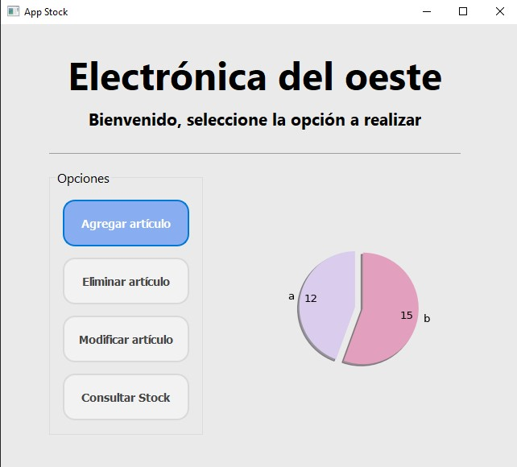
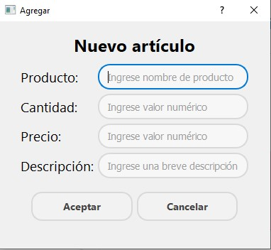
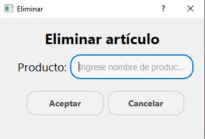
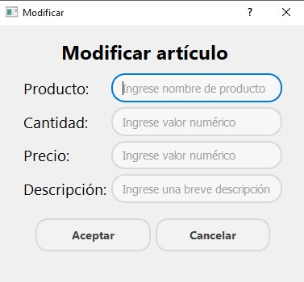
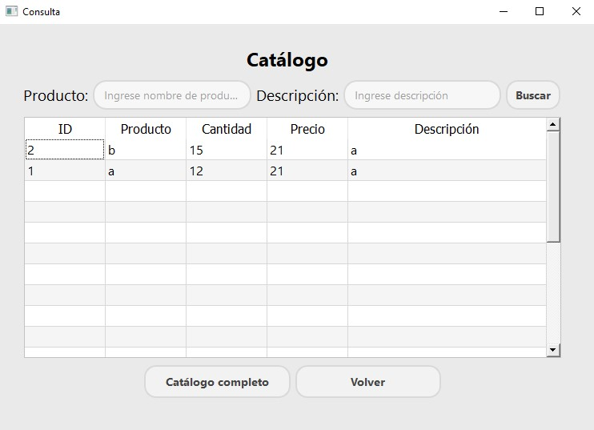

# app_stock

## Autores
Ing. Calderón, Diego  
Sr. Vargas, Nahuel

## Tabla de Contenidos
- [Introducción](#introducción)
- [Aclaraciones](#aclaraciones)
- [Versión Tkinter](#versión_tkinter)
    - [Ejecución](#ejecución)
    - [Uso](#uso)
- [Versión QTDesigner](#versión_qtdesigner)
    - [Ejecución](#ejecución)
    - [Uso](#uso)
- [Versión KivyMD](#versión_kivymd)
    - [Ejecución](#ejecución)
    - [Uso](#uso)
- [Licencia](#licencia)

## Introducción
En este repositorio se contará con la app de control de stock diseñada para el cierre de la diplomatura en Python, 
llevado a cabo en la Universidad Tecnologica Nacional regional Buenos Aire E-Learning.

Se implementa una interfaz de usuario utilizando el patron MVC con una base de datos SQLite. 

## Aclaraciones
En dicha diplomatura consto de realizar un app por etapas, es decir, poner en practica la escalabilidad de un proyecto.
Por eso, se realizo la app con: #Tkinter #QtDesigner #KivyMD.

Las 3 versiones fueron realizadas en un principio en gitlab, en un único proyecto con distintas ramas, al pasar a github (por falta de experiencia),
sólo quedaron resgitrados los commits en la version en Tkinter.

## Versión_Tkinter
### Ejecución
Antes de ejecutar el programa debe segurarse de tener instalado las librerias de peewee, pandas y matplotlib.  
```
pip install peewee
pip install pandas
pip install matplotlib
```
Una vez corroborado que estan instaladas la librerias, ejecutar:  
```
python tkinter/controlador.py
```
### Uso
La app al ejecutarse se tendrá disponible esta única ventana.    

+ **Formulario**: Sección que permite al usuario cargar los datos, estos cuenta con verificación de campos según la accion a realizar.
+ **CRUD**: Acciones a realizar con los datos cargados en formularios.
+ **Recarga de base datos**: Consulta __todos__ los datos en la base datos y carga en la tabla.
+ **Tabla de base de datos**: Se cargan todos o algún datos consultado a la base de datos.

En la sección de formulario, el usuario puede ingresar los siguientes parametros:  
+ *Nombre*
+ *Cantidad*
+ *Precio*
+ *Descripción*  

En la sección CRUD, puede interactuar con la base de datos:  
+ ***Agregar artículo***: se tomarán todos los campos se sección **Formulario**. Estos serán cargados en la base de datos.  
+ ***Eliminar artículo***: se toma sólo el campo **Nombre** y se buscará en la base datos, si existe se elimina de la base
de datos, si no existe no se realiza nada.  
+ ***Modificar artículo***: se toman todos los campos, verificando primero por **Nombre** si existe el artículo. Si existe
se procede a modificar los demas parametros cargados en el fomulario para dicho artículo.  
+ ***Consultar stock***: se toma solo el campo **Nombre**, y se busca en la base de datos. Si existe se muestra en la tabla
con todos sus parametros actuales.

*Dependiendo de la acción a realizar se verifica que los campos involucrados no esten vacios y cumpla el regex (sólo numero/letras)*

Aparte de las acciones disponibles en la sección CRUD, se cuenta con la opción ***Ver Catálogo completo***. El cual lee y 
muestra todos los datos disponibles en la base de datos en la tabla y en un gráfico de tortas, realizado con Matplotlib.

***Toda acción realizada será notificada por medio de popup y por terminal implementando decoradores***

## Versión_QTDesigner
### Ejecución
Antes de ejecutar el programa debe segurarse de tener instalado las librerias de peewee, pandas y matplotlib.  
```
pip install peewee
pip install pandas
pip install matplotlib
pip install PySide2
```
Una vez corroborado que estan instaladas la librerias, ejecutar:  
```
python qtdesigner/controlador.py
```
### Uso
La app al ejecutarse abrirá la ventana principal.    
  
Se cuenta con 2 secciones, una de opciones CRUD para interacturar con la base de datos y en la otra un gráfico de tortas
el cual se actualiza al consultar todos los datos disponibles en la base de datos con **Catálogo completo** disponible en
la ventana **Consulta stock**.
Dependiendo de la opción seleccionada se abre una ventana distinta las cuales son:  
+ ***Agregar artículo***  
      
    Se verifican si los campos no estan vacios y si cumplen el regex correspondiente para cada campo.
    En el caso de no cumplir alguna, no se cargara nada a la base de datos y se notificara en la parte inferior de la pantalla el error.  
+ ***Eliminar artículo***  
      
    Se verifica si el campo no estan vacio y si cumple el regex, en este caso de sólo letras. A su vez, se corrobora que exista el articulo.
    En el caso de no cumplir alguna, no se eliminara nada en la base de datos y se notificara en la parte inferior de la pantalla el error.  
+ ***Modificar artículo***  
      
    Se verifican si los campos no estan vacios y si cumplen el regex correspondiente para cada campo. A su vez, se corrobora que exista el articulo.
    En el caso de no cumplir alguna no se modificara nada en la base de datos y se notificara en la parte inferior de la pantalla.  
+ ***Consultar stock***  
      
    El usuario puede consultar si existe tal articulo ya sea por nombre y/o descripción, si existe se muestra en la tabla aquellos que coincidan por nombre y/o descripcion. Si no existe tal articulo la tabla queda vacia. En el caso que ambos campos esten vacios al dar click en buscar se notifica como *campos vacios*.     
  
    Además se cuenta con la opción de consultar todos los datos disponibles en la base de datos, estos serán cargados en la tabla. Simultaneamente actualiza el gráfico disponible en la ventana principal.
## Versión_KivyMD
### Ejecución
```
python kivymd/controlador.py
```

### Uso

## Licencia


