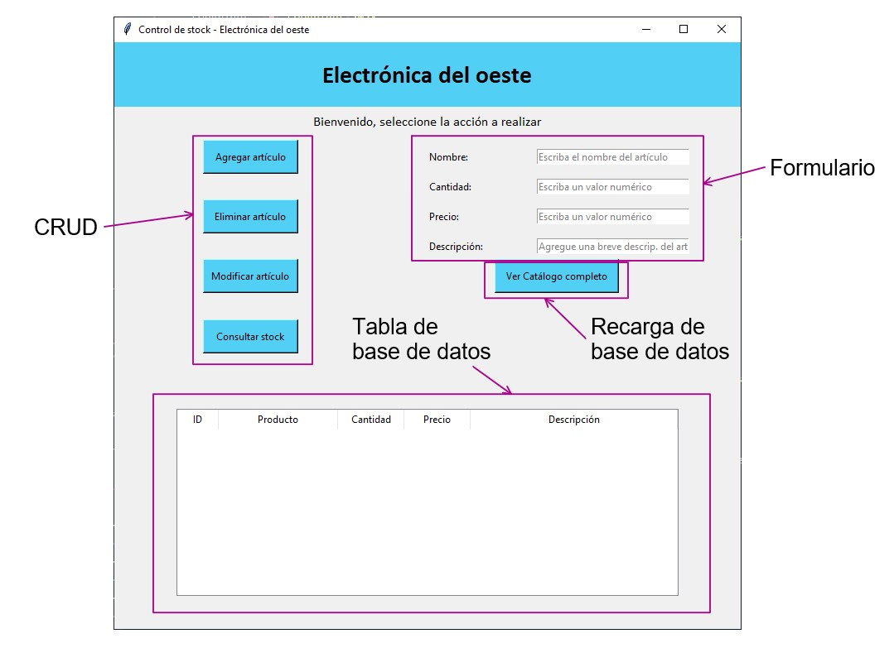

# app_stock

## Autores
Ing. Calderón, Diego  
Sr. Vargas, Nahuel

## Tabla de Contenidos
- [Introducción](#introducción)
- [Aclaraciones](#aclaraciones)
- [Versión Tkinter](#versión_tkinter)
    - [Ejecución](#ejecución)
    - [Entorno](#entorno)
    - [Uso](#uso)
- [Versión QTDesigner](#versión_qtdesigner)
- [Versión KivyMD](#versión_kivymd)
- [Licencia](#licencia)

## Introducción
En este repositorio se contará con la app de control de stock diseñada para el cierre de la diplomatura en Python, 
llevado a cabo en la Universidad Tecnologica Nacional regional Buenos Aire E-Learning.

Se implementa una interfaz de usuario utilizando el patron MVC con una base de datos SQLite. 

## Aclaraciones
En dicha diplomatura consto de realizar un app por etapas, es decir, poner en practica la escalabilidad de un proyecto.
Por eso, se realizo la app con: #Tkinter #QtDesigner #KivyMD.

Las 3 versiones fueron realizadas en un principio en gitlab, en un único proyecto con distintas ramas, al pasar a github (por falta de experiencia),
sólo quedaron resgitrados los commits en la version en Tkinter.

## Versión_Tkinter
### Ejecución
```
python tkinter/controlador.py
```
### Entorno
La app al ejecutarse se tendrá disponible esta única ventana.    

+ **Formulario**: Sección que permite al usuario cargar los datos, estos cuenta con verificación de campos según la accion a realizar.
+ **CRUD**: Acciones a realizar con los datos cargados en formularios.
+ **Recarga de base datos**: Consulta __todos__ los datos en la base datos y carga en la tabla.
+ **Tabla de base de datos**: Se cargan todos o algún datos consultado a la base de datos.
### Uso


## Versión_QTDesigner

## Versión_KivyMD

## Licencia


